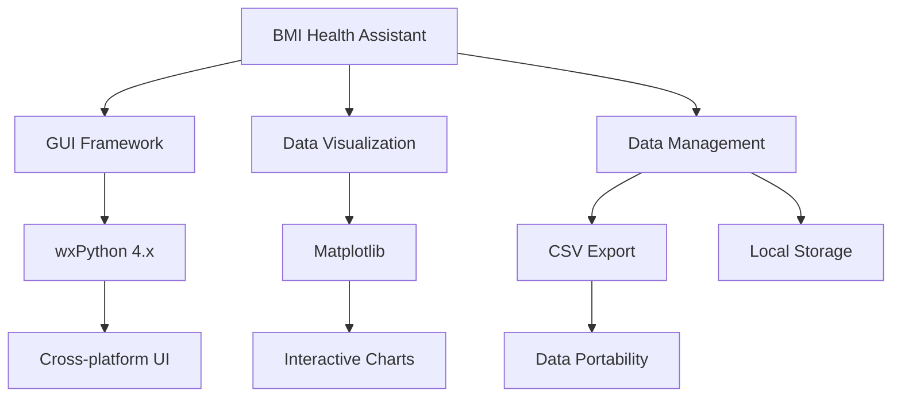

<div align="center">

# 🏥 BMI Health Assistant

### *Your Personal Health & Wellness Companion*

[](https://www.python.org/)
[](https://wxpython.org/)
[](LICENSE)
[](https://github.com/karthikkr-237/PYTHON-JACKFRUIT-PROBLEM/graphs/commit-activity)


[Features](#-features) • [Installation](#-installation) • [Usage](#-usage) • [Screenshots](#-screenshots) • [Contributing](#-contributing)

</div>

---

## 📋 Table of Contents

- [Overview](#-overview)
- [Key Features](#-features)
- [System Requirements](#-system-requirements)
- [Installation](#-installation)
- [Usage Guide](#-usage)
- [Screenshots](#-screenshots)
- [Technical Architecture](#-technical-architecture)
- [Contributing](#-contributing)
- [License](#-license)
- [Support](#-support)

---

## 🌟 Overview

**BMI Health Assistant** is a comprehensive, professional-grade Body Mass Index calculator built with Python and wxPython. Unlike simple BMI calculators, this application provides a complete health tracking ecosystem with personalized recommendations, historical trend analysis, and multi-user support.

### Why BMI Health Assistant? 

✨ **Dual Unit System** - Seamlessly switch between Metric (kg/cm) and Imperial (lbs/ft/in) units  
📊 **Visual Analytics** - Track your BMI journey with beautiful interactive charts  
👥 **Multi-User Support** - Monitor health metrics for your entire family  
🎨 **Modern UI/UX** - Clean, intuitive interface with dark mode support  
📈 **Progress Tracking** - Comprehensive history with CSV export capabilities  
🔒 **Privacy First** - All data stored locally on your machine  

---

## ✨ Features

### 🎯 Core Functionality

| Feature | Description |
|---------|-------------|
| **🔄 Dual Unit System** | Full support for both Metric (kg/cm) and Imperial (lbs/ft/in) measurements |
| **📊 BMI Calculation** | Accurate BMI computation using WHO standards |
| **🎭 Age-Specific Categories** | Different BMI categories for adults and children |
| **💪 Activity Level Tracking** | 5 activity levels from sedentary to extra active |
| **⚖️ Ideal Weight Range** | Personalized healthy weight recommendations |

### 📈 Advanced Features

- **📉 Personal Trend Charts** - Visualize BMI changes over time with matplotlib integration
- **👤 Multi-User Profiles** - Track multiple family members separately
- **🗂️ Calculation History** - Persistent storage of all BMI calculations
- **💾 CSV Export** - Export your health data for external analysis
- **🌙 Dark Mode** - Reduce eye strain with dark theme support
- **💡 Personalized Health Tips** - Context-aware recommendations based on your profile

### 🎨 User Interface Highlights

```
┌─────────────────────────────────────────────────────────────┐
│  Personal Input    │         Charts & Analytics             │
│  ├─ Units Toggle   │  ┌─────────────────────────────────┐  │
│  ├─ Demographics   │  │   📈 BMI Trend Graph           │  │
│  ├─ Measurements   │  │                                 │  │
│  └─ Activity       │  │   (Matplotlib Integration)     │  │
│                    │  └─────────────────────────────────┘  │
│  ┌──────────────┐  │                                       │
│  │ Calculate    │  │  ┌─────────────────────────────────┐  │
│  └──────────────┘  │  │   📊 Calculation History       │  │
│                    │  │                                 │  │
│  BMI:  24.5        │  │   (Grid View with Export)      │  │
│  Category: Normal  │  └─────────────────────────────────┘  │
│                    │                                       │
│  💡 Health Tips    │                                       │
└─────────────────────────────────────────────────────────────┘
```

---

## 💻 System Requirements

### Minimum Requirements

- **Operating System**: Windows 7+, macOS 10.12+, or Linux (Ubuntu 18.04+)
- **Python Version**: 3.8 or higher
- **RAM**: 256 MB
- **Disk Space**: 50 MB

### Recommended Requirements

- **Python Version**: 3.10+
- **RAM**: 512 MB
- **Display**: 1280x720 resolution or higher

---

## 🚀 Installation

### Option 1: Quick Install (Recommended)

```bash
# Clone the repository
git clone https://github.com/karthikkr-237/PYTHON-JACKFRUIT-PROBLEM.git

# Navigate to project directory
cd PYTHON-JACKFRUIT-PROBLEM

# Install required dependencies
pip install -r requirements.txt

# Run the application
python "BMI Project.py"
```

### Option 2: Manual Installation

```bash
# Install dependencies individually
pip install wxPython>=4.1.0
pip install matplotlib>=3.5.0

# Run the application
python "BMI Project.py"
```

### Creating a Virtual Environment (Recommended)

```bash
# Create virtual environment
python -m venv bmi_env

# Activate virtual environment
# On Windows:
bmi_env\Scripts\activate
# On macOS/Linux:
source bmi_env/bin/activate

# Install dependencies
pip install wxPython matplotlib

# Run application
python "BMI Project.py"
```

### 📦 Requirements File

Create a `requirements.txt` file:

```text
wxPython>=4.1.0
matplotlib>=3.5.0
```

---

## 📖 Usage

### Quick Start Guide

1. **Launch the Application**
   ```bash
   python "BMI Project.py"
   ```

2. **Select Your Unit System**
   - Choose between Metric (kg/cm) or Imperial (lbs/ft/in)

3. **Enter Your Information**
   - Full Name
   - Age
   - Gender
   - Activity Level
   - Height
   - Weight

4. **Calculate Your BMI**
   - Click "Calculate BMI" button
   - View your results, category, and ideal weight range

5. **Track Your Progress**
   - Select your name from the dropdown
   - View personalized trend charts
   - Check calculation history

### 🎯 Feature Walkthroughs

#### Metric vs Imperial Units

**Metric Input:**
```
Height: 175. 5 cm
Weight: 70. 2 kg
```

**Imperial Input:**
```
Height: 5 ft 9 in
Weight:  154.8 lbs
```

#### BMI Categories

| BMI Range | Category | Color Code |
|-----------|----------|------------|
| < 16.0 | Severely Underweight | 🔵 Blue |
| 16.0 - 18.4 | Underweight | 🔵 Blue |
| 18.5 - 24.9 | Normal Weight | 🟢 Green |
| 25.0 - 29.9 | Overweight | 🟡 Orange |
| 30.0 - 34.9 | Obesity Class I | 🔴 Red |
| 35.0 - 39.9 | Obesity Class II | 🔴 Red |
| ≥ 40.0 | Obesity Class III | 🔴 Red |

#### Activity Levels

1. **Sedentary** - Little or no exercise
2. **Lightly Active** - Light exercise 1-3 days/week
3. **Moderately Active** - Moderate exercise 3-5 days/week
4. **Very Active** - Hard exercise 6-7 days/week
5. **Extra Active** - Very hard exercise & physical job

### ⌨️ Keyboard Shortcuts

| Shortcut | Action |
|----------|--------|
| `Ctrl + S` | Export to CSV |
| `Ctrl + P` | Export to PDF |
| `Ctrl + D` | Toggle Dark Mode |
| `Ctrl + Q` | Exit Application |
| `F1` | Show Health Tips |

---

## 📸 Screenshots

### Main Interface
<div align="center">

<p><i>Clean and intuitive calculator interface with real-time results</i></p>
</div>

### BMI Trend Chart
<div align="center">

<p><i>Track your health journey with visual analytics</i></p>
</div>

### Calculation History
<div align="center">

<p><i>Comprehensive history with color-coded categories</i></p>
</div>

### Dark Mode
<div align="center">

<p><i>Eye-friendly dark theme for extended use</i></p>
</div>

---

## 🏗️ Technical Architecture

### Technology Stack



### Core Components

| Component | Technology | Purpose |
|-----------|-----------|---------|
| **GUI Framework** | wxPython | Cross-platform desktop interface |
| **Charting Engine** | Matplotlib | BMI trend visualization |
| **Data Storage** | Python Collections | In-memory data management |
| **Export System** | CSV Module | Data portability |
| **Theme System** | wx.SystemSettings | Dynamic theming |

### Project Structure

```
PYTHON-JACKFRUIT-PROBLEM/
├── BMI Project.py          # Main application file
├── README.md               # This file
├── requirements.txt        # Python dependencies
├── LICENSE                 # MIT License
├── docs/                   # Documentation (optional)
│   ├── user-guide.md
│   └── api-reference.md
└── screenshots/            # Application screenshots
    ├── main-interface.png
    ├── charts. png
    └── dark-mode.png
```

### Code Highlights

#### BMI Calculation Formula

```python
def calculate_bmi(weight_kg, height_m):
    """
    Calculate BMI using the standard formula
    BMI = weight (kg) / height² (m²)
    """
    return weight_kg / (height_m * height_m)
```

#### Unit Conversion

```python
# Imperial to Metric
height_m = total_inches * 0.0254
weight_kg = weight_lbs * 0.453592

# Metric to Imperial
height_inches = height_cm * 0.393701
weight_lbs = weight_kg * 2.20462
```

---

## 🎨 Features in Detail

### 1️⃣ Dual Unit System

The application intelligently handles both measurement systems:

- **Automatic conversion** for accurate calculations
- **Persistent storage in metric** for data consistency
- **Display in user's preferred units**

### 2️⃣ Personalized Health Tips

Context-aware recommendations based on: 

- Current BMI category
- Age and gender
- Activity level
- Weight goals

### 3️⃣ Multi-User Support

Track health metrics for:

- Individual family members
- Personal progress over time
- Comparative analysis
- Separate trend charts

### 4️⃣ Data Export

Export your health data in standard formats:

- **CSV Format** - Compatible with Excel, Google Sheets
- **Includes all metrics** - Date, name, measurements, BMI, category
- **UTF-8 Encoding** - International character support

---

## 🔧 Configuration

### Customizing the Application

#### Change Window Size

```python
# In BMICalculator.__init__()
super().__init__(None, title="BMI Health Assistant", size=(1280, 720))
```

#### Modify BMI Categories

```python
def get_bmi_category(self, bmi, age):
    # Customize thresholds as needed
    if bmi < 18.5: return "Underweight"
    elif bmi < 25: return "Normal Weight"
    # ... add custom categories
```

#### Adjust Color Scheme

```python
def get_bmi_color(self, bmi):
    # Modify colors for categories
    if bmi < 18.5: return wx.Colour(0, 0, 255)  # Blue
    elif bmi < 25: return wx.Colour(0, 128, 0)  # Green
    # ... customize colors
```

---

## 🤝 Contributing

We welcome contributions from the community! Here's how you can help:

### Ways to Contribute

1. 🐛 **Report Bugs** - Found an issue? Open a bug report
2. 💡 **Suggest Features** - Have ideas?  We'd love to hear them
3. 📝 **Improve Documentation** - Help make the docs better
4. 💻 **Submit Code** - Fix bugs or add features
5. 🌍 **Translations** - Help localize the application

### Contribution Guidelines

```bash
# Fork the repository
# Create a feature branch
git checkout -b feature/amazing-feature

# Make your changes
git add .
git commit -m "Add amazing feature"

# Push to your fork
git push origin feature/amazing-feature

# Open a Pull Request
```

### Development Setup

```bash
# Clone your fork
git clone https://github.com/YOUR-USERNAME/PYTHON-JACKFRUIT-PROBLEM.git

# Create development environment
python -m venv dev_env
source dev_env/bin/activate  # or dev_env\Scripts\activate on Windows

# Install dependencies
pip install -r requirements.txt

# Run tests (if available)
python -m pytest tests/
```

### Code Style

- Follow [PEP 8](https://pep8.org/) style guidelines
- Use meaningful variable names
- Add docstrings to functions
- Comment complex logic

---

## 📊 Roadmap

### Version 2.1 (Coming Soon)

- [ ] 🔐 User authentication system
- [ ] ☁️ Cloud backup integration
- [ ] 📱 Mobile companion app
- [ ] 🎯 Goal setting and tracking
- [ ] 📧 Email report generation

### Version 3.0 (Future)

- [ ] 🤖 AI-powered health insights
- [ ] 🍎 Nutrition tracking integration
- [ ] 🏃 Exercise logging
- [ ] 👥 Social features and challenges
- [ ] 🌐 Multi-language support

---

## 📜 License

This project is licensed under the **MIT License** - see the [LICENSE](LICENSE) file for details.

```
MIT License

Copyright (c) 2025 karthikkr-237

Permission is hereby granted, free of charge, to any person obtaining a copy
of this software and associated documentation files (the "Software"), to deal
in the Software without restriction, including without limitation the rights
to use, copy, modify, merge, publish, distribute, sublicense, and/or sell
copies of the Software, and to permit persons to whom the Software is
furnished to do so, subject to the following conditions: 

The above copyright notice and this permission notice shall be included in all
copies or substantial portions of the Software. 
```

---

## 🆘 Support

### Getting Help

- 📖 **Documentation**:  Check the [Wiki](https://github.com/karthikkr-237/PYTHON-JACKFRUIT-PROBLEM/wiki)
- 💬 **Discussions**: Join our [GitHub Discussions](https://github.com/karthikkr-237/PYTHON-JACKFRUIT-PROBLEM/discussions)
- 🐛 **Issues**: Report bugs on [GitHub Issues](https://github.com/karthikkr-237/PYTHON-JACKFRUIT-PROBLEM/issues)
- 📧 **Email**: Contact the maintainer

### Frequently Asked Questions

<details>
<summary><b>Q: Does this work on macOS?</b></summary>
Yes! The application is cross-platform and works on Windows, macOS, and Linux. 
</details>

<details>
<summary><b>Q: Is my data stored online?</b></summary>
No.  All data is stored locally on your machine for complete privacy.
</details>

<details>
<summary><b>Q: Can I export my data? </b></summary>
Yes!  Use Ctrl+S to export your calculation history to CSV format.
</details>

<details>
<summary><b>Q: Do I need matplotlib installed?</b></summary>
Charts require matplotlib, but the core BMI calculation works without it.
</details>

---

## 🙏 Acknowledgments

- **wxPython Team** - For the excellent GUI framework
- **Matplotlib Developers** - For powerful data visualization
- **Python Community** - For continuous support and inspiration
- **Health Organizations** - For BMI standards and guidelines

---

## 📈 Project Stats


---

## 🌟 Star History

If you find this project helpful, please consider giving it a ⭐! 

<div align="center">

### Made with ❤️ by [karthikkr-237](https://github.com/karthikkr-237)

**[⬆ Back to Top](#-bmi-health-assistant)**

---

<sub>Last Updated: December 2025</sub>

</div>